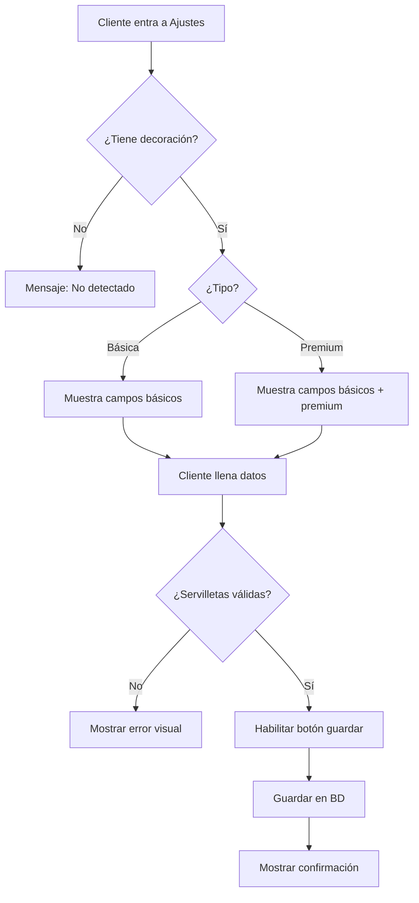

# 🎨 Sistema de Decoración Detallada - Implementación Completa

## 📋 Descripción General

Se ha implementado un sistema completo de personalización de decoración para clientes, que se adapta dinámicamente según el tipo de decoración contratada (Básica o Premium).

---

## ✅ ¿Qué se implementó?

### 1. **Migración SQL** ✅
**Archivo**: `database/migration_decoracion_detallada.sql`

**Nuevos campos agregados a `ajustes_evento`**:

#### Decoración Básica:
- `tipo_decoracion` - Identifica si es básica o premium
- `cojines_color` - Negro o Blanco
- `centro_mesa_1`, `centro_mesa_2`, `centro_mesa_3` - Tres opciones de centros de mesa
- `base_color` - Silver, dorado, clear, candelabro, árbol
- `challer_color` - Dorado, silver, clear
- `servilletas` - JSONB con array de colores y cantidades
- `aros_color` - Silver, dorado, clear, otro
- `aros_nota` - Nota adicional si elige "otro"
- `runner_tipo` - Dorado, silver, morado, azul, etc.
- `runner_nota` - Nota adicional si elige "otros"
- `stage_tipo` - Globos o flores
- `stage_color_globos` - Colores de globos si aplica

#### Decoración Premium:
- `decoracion_premium_detalles` - Texto libre para detalles especiales (animales de peluche, columpios, etc.)
- **Incluye todos los campos de decoración básica**

---

### 2. **Componente Frontend** ✅
**Archivo**: `frontend/src/components/SeccionDecoracion.jsx`

#### Características:
✅ **Detección Automática**: Detecta el tipo de decoración del contrato  
✅ **Interfaz Adaptativa**: Muestra campos específicos según Básica o Premium  
✅ **Validación de Servilletas**: Sistema inteligente que valida:
  - Cantidad total debe igualar número de invitados
  - Respeta límites por color (blanca ilimitada, otros limitados)
  - Validación visual en tiempo real

#### UI/UX:
- 🎨 Interfaz colorida y moderna
- ✅ Validación visual con mensajes claros
- 🔒 Bloqueo automático 10 días antes del evento
- 📝 Notas contextuales para ayudar al cliente

---

### 3. **Validación de Servilletas** ✅

#### Lógica Implementada:
```javascript
// Opciones con cantidades específicas
SERVILLETAS_OPCIONES = [
  { color: 'blanca', cantidad_disponible: ∞ },
  { color: 'rosada', cantidad_disponible: 40 },
  { color: 'azul', cantidad_disponible: 80 },
  { color: 'beige', cantidad_disponible: 80 },
  { color: 'roja', cantidad_disponible: 80 },
  { color: 'verde', cantidad_disponible: 80 },
  { color: 'morada', cantidad_disponible: 80 },
  { color: 'vinotinto', cantidad_disponible: 80 },
  { color: 'negro', cantidad_disponible: 80 }
]
```

**Ejemplo de Validación**:
- Cliente tiene 80 invitados
- Selecciona: Rosada (40) + Azul (40) = ✅ Válido
- Selecciona: Rosada (50) = ❌ Error "Solo hay 40 servilletas rosadas"
- Selecciona: Rosada (40) = ❌ Error "Faltan 40 servilletas"

---

### 4. **Backend** ✅
**Archivo**: `backend/src/routes/ajustes.routes.js`

Ya estaba preparado para recibir cualquier campo. No requirió modificaciones adicionales.

---

### 5. **Schema Prisma** ✅
**Archivo**: `backend/prisma/schema.prisma`

Agregados 17 nuevos campos al modelo `ajustes_evento` para decoración detallada.

---

## 📦 Archivos Creados/Modificados

| Archivo | Acción | Descripción |
|---------|--------|-------------|
| `database/migration_decoracion_detallada.sql` | ✅ Creado | Migración SQL con nuevos campos |
| `frontend/src/components/SeccionDecoracion.jsx` | ✅ Creado | Componente completo de decoración |
| `frontend/src/pages/cliente/AjustesEvento.jsx` | ✅ Modificado | Importa y usa nuevo componente |
| `backend/prisma/schema.prisma` | ✅ Modificado | Agregados campos de decoración |

---

## 🚀 Pasos para Activar

### 1. **Ejecutar Migración SQL**
```bash
psql -U postgres -d diamondsistem -f "C:\Users\eac\Desktop\DiamondSistem\database\migration_decoracion_detallada.sql"
```

### 2. **Regenerar Cliente Prisma**
```bash
cd backend
npx prisma generate
```

### 3. **Reiniciar Backend**
```bash
npm run dev
```

### 4. **Probar en Frontend**
1. Login como cliente
2. Ir a "Ajustes del Evento" → Pestaña "Decoración"
3. El sistema automáticamente detectará el tipo de decoración

---

## 🎯 Cómo Funciona

### **Decoración Básica**
1. Cliente accede a Ajustes → Decoración
2. Sistema detecta "Decoración Básica" en el contrato
3. Muestra formulario con opciones específicas:
   - Radio buttons para cojines (negro/blanco)
   - 3 selectores para centros de mesa
   - Selectores para base, challer, aros, runner
   - Sistema inteligente de servilletas con validación
   - Selector de stage (globos o flores)

### **Decoración Premium**
1. Cliente accede a Ajustes → Decoración
2. Sistema detecta "Decoración Plus/Premium" en el contrato
3. Muestra:
   - ⭐ Badge "Premium"
   - Todos los campos de decoración básica
   - Campo de texto especial para detalles premium
   - Nota informativa sobre elementos incluidos

---

## 🧪 Casos de Prueba

### ✅ Test 1: Validación de Servilletas
**Escenario**: Cliente con 100 invitados  
**Acción**: Selecciona Blanca (100)  
**Resultado Esperado**: ✅ Válido

### ✅ Test 2: Validación de Stock Limitado
**Escenario**: Cliente con 80 invitados  
**Acción**: Selecciona Rosada (50)  
**Resultado Esperado**: ❌ Error "Solo hay 40 servilletas rosadas"

### ✅ Test 3: Validación de Cantidad Total
**Escenario**: Cliente con 80 invitados  
**Acción**: Selecciona Azul (60)  
**Resultado Esperado**: ❌ Error "Faltan 20 servilletas"

### ✅ Test 4: Bloqueo por Fecha
**Escenario**: Evento en 5 días  
**Acción**: Intenta guardar cambios  
**Resultado Esperado**: ❌ Botón bloqueado con mensaje

---

## 📊 Estructura de Datos

### **Servilletas en Base de Datos (JSONB)**
```json
[
  { "color": "blanca", "cantidad": 40 },
  { "color": "azul", "cantidad": 40 }
]
```

### **Centros de Mesa**
```sql
centro_mesa_1 = 'flor'
centro_mesa_2 = 'candelabro'
centro_mesa_3 = 'cilindro'
```

---

## 🎨 Capturas de UI

### **Decoración Básica**
- ✅ Radio buttons estilizados para cojines
- ✅ Selectores organizados en grid
- ✅ Validador visual de servilletas con colores
- ✅ Mensajes de ayuda contextuales

### **Decoración Premium**
- ⭐ Badge destacado "Premium"
- ✅ Todos los campos básicos + campo especial
- ✅ Textarea amplio para detalles premium
- ✅ Nota informativa sobre inclusiones

---

## 💡 Notas Importantes

1. **Servilletas Blancas**: Son ilimitadas, por lo que si el cliente las selecciona, se ajustan automáticamente al total de invitados.

2. **Campos Obligatorios**: El sistema no fuerza campos obligatorios, pero el botón guardar se deshabilita si las servilletas no cuadran.

3. **Tipo de Decoración**: Se detecta automáticamente del contrato buscando servicios con categoría "Decoración".

4. **Premium Include Básica**: La decoración premium incluye TODOS los elementos de la básica más elementos especiales.

5. **Validación en Tiempo Real**: El sistema valida las servilletas mientras el cliente las selecciona, mostrando mensajes claros.

---

## 🔄 Flujo Completo



---

## 🎉 ¡Implementación Completa!

Todos los requisitos han sido implementados exitosamente:
- ✅ Detección automática de tipo de decoración
- ✅ Campos personalizados para decoración básica
- ✅ Campos especiales para decoración premium
- ✅ Validación inteligente de servilletas
- ✅ UI/UX moderna y responsiva
- ✅ Backend preparado y escalable

---

**Siguiente paso**: Ejecutar la migración SQL y regenerar Prisma.


