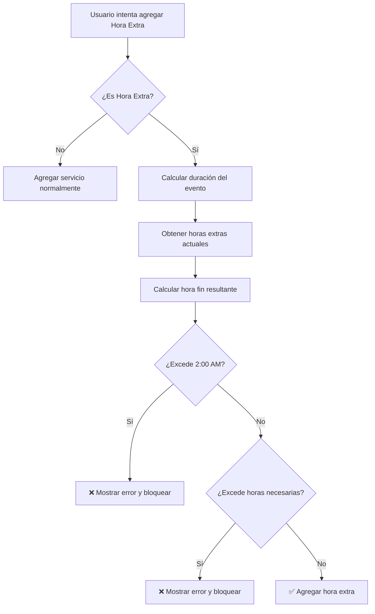

# 🕐 Validación de Horas Extras - Documentación

## 📋 Resumen

Este documento explica cómo funciona la validación inteligente de horas extras que previene que los eventos excedan el límite legal de las 2:00 AM.

---

## 🎯 Objetivo

Garantizar que:
1. **Ningún evento termine después de las 2:00 AM** (límite legal).
2. **No se agreguen más horas extras de las necesarias**.
3. **El sistema calcule automáticamente** el máximo de horas extras permitidas.

---

## 🧮 Lógica de Cálculo

### Fórmula Principal

```javascript
Hora Fin Resultante = Hora Inicio + Duración Base del Paquete + Horas Extras Agregadas
```

### Restricción Legal

```javascript
Hora Fin Resultante ≤ 02:00 AM (26:00 en formato 24h del día siguiente)
```

---

## 📍 Lugares de Implementación

### 1. **Área del Vendedor - Crear Oferta**
📁 `frontend/src/pages/CrearOferta.jsx`

#### Función: `agregarServicio()`

**Validaciones:**
- ✅ Verifica si agregar una hora extra excedería las 2:00 AM
- ✅ Calcula cuántas horas extras son realmente necesarias
- ✅ Bloquea agregar más horas de las necesarias
- ✅ Muestra mensaje detallado con la razón del bloqueo

**Ejemplo de cálculo:**
```javascript
// Evento: 6:00 PM - 1:00 AM = 7 horas
// Paquete: 5 horas
// Horas extras necesarias: 2 horas

const duracionEvento = 7; // calculado desde hora_inicio y hora_fin
const duracionBasePaquete = 5; // desde paquetes.duracion_horas
const horasExtrasNecesarias = Math.ceil(7 - 5) = 2;

// Si ya tienes 2 horas extras agregadas, NO puedes agregar más
```

---

### 2. **Área del Vendedor - Editar Oferta**
📁 `frontend/src/pages/EditarOferta.jsx`

**Idéntica lógica** a CrearOferta.jsx, aplicada al editar ofertas existentes.

---

### 3. **Área del Cliente - Solicitar Cambios**
📁 `frontend/src/pages/cliente/SolicitarCambios.jsx`

#### Función: `handleSubmitServicio()`

**Validaciones adicionales:**
- ✅ Cuenta las horas extras **ya existentes en el contrato**
- ✅ Suma las horas extras **solicitadas anteriormente**
- ✅ Calcula el total después de la nueva solicitud
- ✅ Bloquea si excede el límite de 2:00 AM
- ✅ Muestra toast con información detallada

**Ejemplo de cálculo para cliente:**
```javascript
// Contrato existente:
// - Evento: 7:00 PM - 2:00 AM = 7 horas
// - Paquete: 5 horas
// - Horas extras en contrato: 2 horas

const horasExtrasContrato = 2; // desde contratos_servicios
const cantidadSolicitada = 1; // nueva solicitud
const totalConSolicitud = 2 + 1 = 3;

// Calcular hora de fin: 19:00 + 5 + 3 = 27:00 (3:00 AM) ❌ EXCEDE
// Bloquear solicitud y mostrar error
```

---

## ⚠️ Mensajes de Error

### Error 1: Excede las 2:00 AM

```
⚠️ NO PUEDES AGREGAR MÁS HORAS EXTRAS

Tu evento dura 8.0 horas.
El paquete incluye 5 horas.
Ya tienes 2 hora(s) extra agregada(s).

🚫 Si agregas 3 hora(s) extra, tu evento terminaría después de 
las 2:00 AM, lo cual NO está permitido por restricciones legales.

Máximo de horas extras permitidas: 2
```

### Error 2: No son necesarias más horas

```
⚠️ NO NECESITAS MÁS HORAS EXTRAS

Tu evento requiere exactamente 2 hora(s) extra.
Ya tienes 2 hora(s) agregada(s).

No es necesario agregar más.
```

---

## 🔢 Casos de Ejemplo

### Caso 1: Evento que termina a las 2:00 AM (Límite Exacto)

```
Hora Inicio: 7:00 PM (19:00)
Hora Fin: 2:00 AM (02:00 del día siguiente = 26:00)
Duración: 7 horas

Paquete: Diamond (5 horas)
Horas extras necesarias: 2 horas

✅ PERMITIDO: 2 horas extras (19:00 + 5 + 2 = 26:00 = 2:00 AM)
❌ BLOQUEADO: 3 horas extras (19:00 + 5 + 3 = 27:00 = 3:00 AM)
```

### Caso 2: Evento que no necesita horas extras

```
Hora Inicio: 7:00 PM (19:00)
Hora Fin: 12:00 AM (00:00 = 24:00)
Duración: 5 horas

Paquete: Deluxe (5 horas)
Horas extras necesarias: 0 horas

❌ BLOQUEADO: 1 hora extra (no es necesaria)
```

### Caso 3: Evento que termina antes de medianoche

```
Hora Inicio: 2:00 PM (14:00)
Hora Fin: 8:00 PM (20:00)
Duración: 6 horas

Paquete: Básico (4 horas)
Horas extras necesarias: 2 horas

✅ PERMITIDO: 2 horas extras
❌ BLOQUEADO: 3 horas extras (no son necesarias)
```

---

## 🔧 Funciones Auxiliares

### `calcularHorasExtras()`

**Ubicación:** `CrearOferta.jsx` y `EditarOferta.jsx`

**Retorna:**
```javascript
{
  necesarias: number,      // Horas extras requeridas
  duracionEvento: number,  // Duración total del evento
  duracionTotal: number    // Duración base del paquete
}
```

**Lógica:**
```javascript
const calcularHorasExtras = () => {
  if (!paqueteSeleccionado || !formData.hora_inicio || !formData.hora_fin) {
    return { necesarias: 0, duracionEvento: 0, duracionTotal: 0 };
  }

  const [horaInicioH, horaInicioM] = formData.hora_inicio.split(':').map(Number);
  const [horaFinH, horaFinM] = formData.hora_fin.split(':').map(Number);
  
  let duracionEvento = (horaFinH + (horaFinM / 60)) - (horaInicioH + (horaInicioM / 60));
  
  // Si la hora de fin es menor, el evento cruza la medianoche
  if (duracionEvento < 0) {
    duracionEvento += 24;
  }

  // La duración del paquete es solo la duración base (NO se suman horas extras incluidas)
  const duracionTotal = paqueteSeleccionado.duracion_horas || 0;
  
  // Calcular horas extras adicionales necesarias
  const horasExtrasNecesarias = Math.max(0, Math.ceil(duracionEvento - duracionTotal));

  return { necesarias: horasExtrasNecesarias, duracionEvento, duracionTotal };
};
```

---

## 🧪 Testing Manual

### Test 1: Agregar Hora Extra Permitida
1. Crear oferta con Paquete Diamond (5 horas)
2. Hora Inicio: 7:00 PM
3. Hora Fin: 1:00 AM (6 horas totales)
4. Intentar agregar 1 Hora Extra
5. **Resultado esperado:** ✅ Se agrega sin problema

### Test 2: Agregar Hora Extra que Excede
1. Crear oferta con Paquete Diamond (5 horas)
2. Hora Inicio: 7:00 PM
3. Hora Fin: 2:00 AM (7 horas totales)
4. Agregar 2 Horas Extra
5. Intentar agregar 1 Hora Extra más
6. **Resultado esperado:** ❌ Error: "No puedes agregar más horas extras"

### Test 3: Cliente Solicita Hora Extra Innecesaria
1. Contrato con Paquete Deluxe (5 horas)
2. Evento: 7:00 PM - 12:00 AM (5 horas exactas)
3. Cliente intenta solicitar 1 Hora Extra
4. **Resultado esperado:** ❌ Error: "No necesitas más horas extras"

---

## 📊 Flujo de Decisión



---

## ⚙️ Variables Clave

| Variable | Descripción | Ejemplo |
|----------|-------------|---------|
| `duracionEvento` | Horas totales del evento | 7.5 horas |
| `duracionBasePaquete` | Horas base del paquete | 5 horas |
| `horasExtrasNecesarias` | Horas extras requeridas | 3 horas |
| `horasExtrasContrato` | Horas extras ya en el contrato | 1 hora |
| `totalHorasExtrasConSolicitud` | Total después de nueva solicitud | 2 horas |
| `horaFinResultante` | Hora calculada de fin del evento | 26.0 (2:00 AM) |
| `HORA_MAXIMA_FIN` | Límite legal | 26.0 (2:00 AM) |

---

## 🚀 Beneficios

✅ **Cumplimiento Legal:** Garantiza que ningún evento exceda el horario permitido.

✅ **Transparencia:** Mensajes claros explican por qué se bloquea una acción.

✅ **Prevención de Errores:** Evita que vendedores y clientes agreguen horas innecesarias.

✅ **Cálculo Automático:** No requiere intervención manual para verificar límites.

✅ **Consistencia:** Misma lógica aplicada en vendedor y cliente.

---

## 📝 Notas Importantes

1. **Formato 24h Extendido:** Se usa formato 24h donde 26:00 = 2:00 AM del día siguiente.

2. **Redondeo hacia arriba:** Las horas extras necesarias se redondean hacia arriba (`Math.ceil`).

3. **Solo Duración Base:** El cálculo usa SOLO `paquetes.duracion_horas`, NO incluye horas extras del paquete.

4. **Validación Doble:**
   - Vendedor: Al agregar servicios en oferta
   - Cliente: Al solicitar servicios adicionales

---

## 🐛 Debugging

Si la validación no funciona correctamente, verifica:

1. ✅ `hora_inicio` y `hora_fin` están en formato `HH:mm`
2. ✅ `paquetes.duracion_horas` existe y es correcto
3. ✅ `servicios.nombre` es exactamente "Hora Extra"
4. ✅ `contratos_servicios` incluye relación con `servicios`

---

**Última actualización:** Noviembre 2025  
**Autor:** Sistema DiamondSistem  
**Versión:** 2.0


